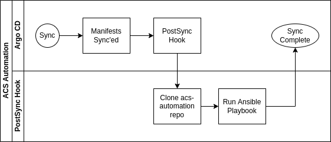

### Introduction

This is an ansible playbook for configuring Red Hat Advanced Cluster Security (i.e. Stackrox). Specifically this configures an openshift authentication provider along with setting up user access to ACS in terms of access scopes and permission sets.

The playbook uses the uri module to drive the ACS API, the configuration that is created is managed the variables in vars/vars.yaml.

### Using

You can invoke the playbook by passing either username/password or API token to the playbook. To use it with the default Central username/password:

```ansible-playbook acs.yaml -e username=admin -e password=XXXXXX -e api_endpoint=central-stackrox.apps.home.ocplab.com```

To invoke it with an API token created in ACS:

```ansible-playbook acs.yaml -e api_token=XXXXXXX -e api_endpoint=central-stackrox.apps.home.ocplab.com```

### Integrating with GitOps

Integrating this automation with an existing installation of ACS via Argo CD is very straightfoward:

1. Fork the repo and update the `vars/vars.yaml` to reflect the configuration that you want

2. Update your Argo CD configuration to include a health check for Central:

```
platform.stackrox.io/Central:
    health.lua: |
    hs = {}
    if obj.status ~= nil and obj.status.conditions ~= nil then
        for i, condition in ipairs(obj.status.conditions) do
            if condition.status == "True" or condition.reason == "InstallSuccessful" or condition.reason == "UpgradeSuccessful" then
                hs.status = "Healthy"
                hs.message = "Install Successful"
                return hs
            end
        end
    end
    hs.status = "Progressing"
    hs.message = "Waiting for Central to deploy."
    return hs
```

3. Create a kubernetes job to run the playbook, this is recommended to be configured as a post-sync hook. You can see a complete example of the job I use [here](https://github.com/gnunn-gitops/cluster-config/blob/main/components/apps/acs-operator/overlays/oauth/init-acs.yaml).

Here is a diagram of how it works with Argo CD.

